# Interview Management System - Architecture Diagrams

## 1. High-Level System Architecture

```mermaid
graph TB
    subgraph "🖥️ Client Side"
        UI[Next.js 15 App Router]
        Components[React 19 Components]
        VideoSDK[Stream Video SDK]
        Editor[Monaco Code Editor]
        ShadcnUI[shadcn/ui Components]
    end
    
    subgraph "🔐 Authentication"
        ClerkAuth[Clerk Authentication]
        JWT[JWT Token Management]
        Middleware[Next.js Middleware]
        RoleGuard[Role-based Access Control]
    end
    
    subgraph "⚡ Backend Services"
        ConvexDB[Convex Real-time Database]
        ServerFunctions[Convex Server Functions]
        StreamAPI[Stream Video API]
        ServerActions[Next.js Server Actions]
    end
    
    subgraph "☁️ Cloud Infrastructure"
        VercelHost[Vercel Hosting]
        ClerkCloud[Clerk Cloud Auth]
        ConvexCloud[Convex Cloud Backend]
        StreamCloud[Stream Video Cloud]
    end
    
    UI --> ClerkAuth
    UI --> ConvexDB
    UI --> StreamAPI
    Components --> VideoSDK
    Components --> Editor
    Components --> ShadcnUI
    ClerkAuth --> JWT
    JWT --> Middleware
    Middleware --> RoleGuard
    RoleGuard --> ServerFunctions
    ServerFunctions --> ConvexDB
    ServerActions --> StreamAPI
    
    UI -.-> VercelHost
    ClerkAuth -.-> ClerkCloud
    ConvexDB -.-> ConvexCloud
    StreamAPI -.-> StreamCloud
    
    classDef client fill:#e3f2fd,stroke:#1976d2,stroke-width:2px
    classDef auth fill:#fff3e0,stroke:#f57c00,stroke-width:2px
    classDef backend fill:#f3e5f5,stroke:#7b1fa2,stroke-width:2px
    classDef cloud fill:#e8f5e8,stroke:#388e3c,stroke-width:2px
    
    class UI,Components,VideoSDK,Editor,ShadcnUI client
    class ClerkAuth,JWT,Middleware,RoleGuard auth
    class ConvexDB,ServerFunctions,StreamAPI,ServerActions backend
    class VercelHost,ClerkCloud,ConvexCloud,StreamCloud cloud
```



## 2. Enhanced Database Schema & Relationships


## 3. Complete Authentication & Authorization Flow

```mermaid
sequenceDiagram
    participant User as 👤 User
    participant Browser as 🌐 Browser
    participant Middleware as 🛡️ Next.js Middleware
    participant Clerk as 🔐 Clerk Auth
    participant Convex as ⚡ Convex Backend
    participant StreamAPI as 📹 Stream API
    
    Note over User,StreamAPI: Initial Authentication
    User->>Browser: Access Application
    Browser->>Middleware: Route Request
    Middleware->>Clerk: Check Authentication
    
    alt User Not Authenticated
        Clerk->>Browser: Redirect to Sign In
        Browser->>User: Show Login Form
        User->>Clerk: Submit Credentials
        Clerk->>Clerk: Validate & Generate JWT
        Clerk->>Browser: Set Auth Cookies
    end
    
    Note over User,StreamAPI: Authenticated Request Flow
    Browser->>Middleware: Request with JWT
    Middleware->>Middleware: Validate JWT Token
    Middleware->>Convex: Forward Request + User Context
    Convex->>Clerk: Verify Token Signature
    Clerk->>Convex: Token Valid + User Info
    
    alt Database Operation
        Convex->>Convex: Execute Query/Mutation
        Convex->>Browser: Return Data
    end
    
    alt Video Call Creation
        Convex->>StreamAPI: Create Call with User Token
        StreamAPI->>StreamAPI: Generate Call Token
        StreamAPI->>Convex: Return Call Details
        Convex->>Browser: Video Call Ready
    end
    
    Browser->>User: Render Protected Content
```



## 4. Interview Creation Data Flow


## 5. User Journey - Complete Interview Process


## 6. Component Architecture Diagram

```mermaid
graph TB
    subgraph "App Router Pages"
        A[layout.tsx]
        B[page.tsx - Home]
        C[dashboard/page.tsx]
        D[meeting/[id]/page.tsx]
        E[schedule/page.tsx]
        F[recordings/page.tsx]
    end
    
    subgraph "Providers"
        G[ConvexClerkProvider]
        H[StreamClientProvider]
        I[ThemeProvider]
    end
    
    subgraph "Core Components"
        J[Navbar]
        K[MeetingRoom]
        L[MeetingSetup]
        M[CodeEditor]
        N[Calendar]
    end
    
    subgraph "UI Components"
        O[Button]
        P[Dialog]
        Q[Card]
        R[Avatar]
    end
    
    subgraph "Custom Hooks"
        S[useGetCalls]
        T[useGetCallById]
        U[useMeetingActions]
        V[useUserRole]
    end
    
    A --> G
    G --> H
    H --> I
    B --> J
    D --> K
    K --> L
    K --> M
    E --> N
    J --> O
    K --> P
    N --> Q
    J --> R
    K --> S
    D --> T
    L --> U
    J --> V
```

## 7. Real-time Data Synchronization


## 8. Meeting State Management


## 9. Security & Authorization Flow


## 10. Deployment Architecture

